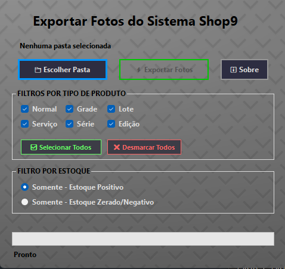

# Exporta Fotos Shop9
Este aplicativo permite exportar fotos de produtos do sistema Shop9 para uma pasta local, com filtros avançados por tipo de produto e estoque.

<h1 align="center"><figure>
  
</figure></h1>

## 🙌 Agradecimento Técnico

Agradeço ao [@SamuelAlbert](https://github.com/SamuelAlbert) pela contribuição na concepção do protótipo do aplicativo. A abordagem adotada em seu projeto desenvolvido com Python foi essencial para orientar a definição da estrutura inicial e alinhar meu desenvolvimento em C# com boas práticas de arquitetura e organização de código.
